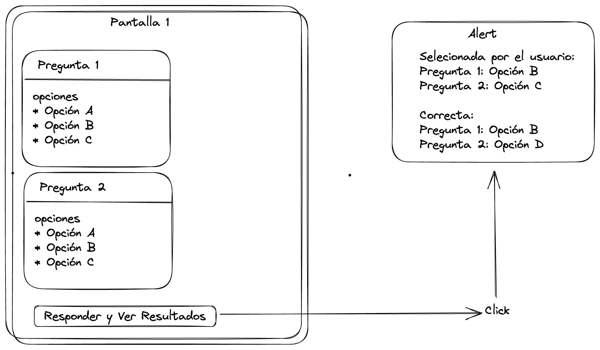
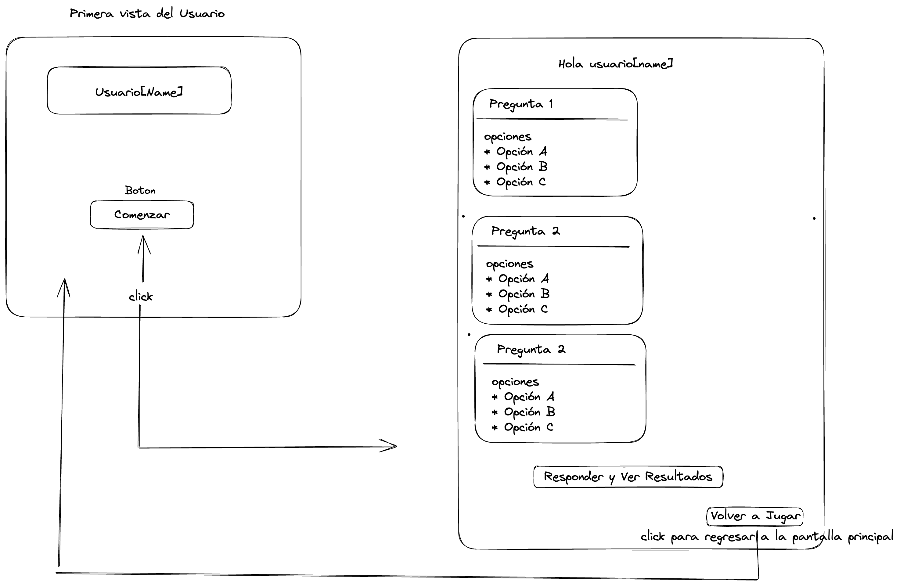

# Trivia-Laboratoria
Proyecto Trivia Laboratoria

# Hito 1

1. Se realizo la elaboración del prototipo

2. Para hacer la selección de preguntas, decidimimos utilizar la etiqueta `<form>` ya que es un elemento HTML que se utiliza para crear un formulario en una página web. El formulario puede contener uno o más elementos de entrada de formulario, como campos de texto, botones de opción, casillas de verificación, menús desplegables, botones de radio y botones de envío.

3. Dentro de la etiqueta `<form>` para agrupar estas dos preguntas que se van ha realizar se utilizo la etiqueta `<section>` que ya que es un elemento HTML que se utiliza para agrupar contenido relacionado en una página web. Se utiliza comúnmente para dividir una página en secciones temáticas y para facilitar la organización y el mantenimiento del código HTML.

4. 
- La etiqueta `<label>` en HTML se utiliza para asociar una etiqueta de texto con un control de formulario, como un campo de entrada de texto, un botón de opción, una casilla de verificación o un menú desplegable. El atributo for del elemento `<label>` se utiliza para especificar el id del control de formulario con el que está asociado.

- La etiqueta `<input>` en HTML se utiliza para crear campos de entrada de datos interactivos en un formulario. Los tipos de campos de entrada que se pueden crear con la etiqueta `<input>` incluyen texto, contraseña, correo electrónico, número, fecha, hora, archivo, botones de opción, casillas de verificación y muchos más. El atributo type se utiliza para especificar el tipo de campo de entrada que se creará.

5. Agregamos la etiqueta `<button>` que se utiliza para crear un botón interactivo en una página web, agregando el atributo "onclick" para ejecutar una función JavaScript cuando se hace clic en el botón.

6. 
- Dentro de la etiqueta `<script>` se realizó una función de JavaScript que toma dos elementos de entrada (input) de un formulario HTML con nombres "answer" y "answer2" respectivamente, y verifica si se ha seleccionado una opción para cada uno de ellos. Si el usuario no ha seleccionado una opción para uno o ambos, la función muestra un mensaje de alerta indicando que el usuario olvidó seleccionar una respuesta. Si el usuario ha seleccionado una respuesta para ambos, la función muestra un mensaje de alerta que indica qué opción seleccionó el usuario para cada uno.

- La función utiliza el método querySelector para obtener los elementos de entrada seleccionados por el usuario, utilizando la sintaxis input[name = "nombre_del_input"]:checked. Esto selecciona el elemento de entrada con el atributo name especificado y comprueba si está marcado como "checked" (seleccionado). Si el elemento no está seleccionado, el valor de la variable será undefined.

- La función luego utiliza una declaración if...else para verificar si alguna de las variables es undefined. Si lo son, la función establece un mensaje de alerta que indica que el usuario olvidó seleccionar una respuesta. Si ambos tienen valores definidos, la función establece un mensaje de alerta que indica qué opción seleccionó el usuario para cada una de las preguntas.

Por último, la función muestra el mensaje de alerta utilizando el método alert.

### Hito 1 Soporte Link

[etiqueta input con sus respectivos types](https://developer.mozilla.org/en-US/docs/Web/HTML/Element/input/radio)

[pregunta sobre radio button seleccionado en stackoverflow](https://stackoverflow.com/questions/15839169/how-to-get-the-value-of-a-selected-radio-button)

[porque utilizamos querySelector](https://stackoverflow.com/questions/15839169/how-to-get-the-value-of-a-selected-radio-button)

[documentación querySelector](https://developer.mozilla.org/en-US/docs/Web/API/Document/querySelector)

[ejemplos y explicaciones de query selector](https://www.javascripttutorial.net/javascript-dom/javascript-queryselector/)

# HITO 2

1. Se realizo la elaboración del prototipo

2. Se le solicita al usuario que ingrese su nombre y luego lo envía a una página llamada questions.html mediante el método GET.

El formulario contiene un campo de entrada de texto, que permite al usuario escribir su nombre. También tiene una etiqueta label que proporciona una descripción para este campo de entrada.

Por último, hay un botón "Comenzar" que el usuario puede hacer clic para enviar el formulario. Al hacer clic en este botón, se ejecutará una función llamada setName(). La función tiene tres partes:

* La función utiliza la función getElementById para buscar el elemento HTML con el id "userName". Este elemento es un campo de entrada de texto donde el usuario ingresó su nombre.

* Tiene una declaración if para verificar si el campo de entrada está vacío. Si el campo de entrada está vacío, la función muestra una ventana de alerta para recordar al usuario que debe ingresar su nombre. Si el campo de entrada tiene algún valor, la función continúa.

* Por último, la función utiliza la función localStorage.setItem para almacenar el nombre del usuario en la memoria del navegador. Esto significa que el nombre del usuario se guardará incluso si el usuario cierra el navegador o la página web. El nombre del usuario se guarda bajo la clave "name" en el almacenamiento local del navegador.

En resumen, esta función se utiliza para verificar que el usuario haya ingresado su nombre en el formulario y luego almacenar ese nombre en el almacenamiento local del navegador.

3. Se despliega la siguiente pantalla con las 3 preguntas y sus respectivas 3 opciones.

4. Se realizan las validaciones correspondientes, para saber si las respuestas seleccionadas por el usurio son correcta o incorrectas, se trabajo con condicionales para dicha validación `if .... else`. 

5. Para que estas respuestas aparecieran en el HTML se utilizó `createElement` que es una función de JavaScript que se utiliza para crear un nuevo elemento HTML en una página web. La función createElement toma un argumento que especifica el tipo de elemento que se desea crear, como "div", "p", "img", "input", entre otros. Así utilizando el `appendChild` para agregar el elemento ya creado en sus respectivos párrafos.
### Hito 2 Soporte Link

[button y sus elementos](https://developer.mozilla.org/en-US/docs/Web/HTML/Element/button)

[pasando data a otro HTML](https://stackoverflow.com/questions/14693758/passing-form-data-to-another-html-page)

[explicación del appendChild](https://developer.mozilla.org/en-US/docs/Web/API/Node/appendChild)

[creando un nuevo elemento en HTML](https://www.w3schools.com/js/js_htmldom_nodes.asp#:~:text=To%20add%20text%20to%20the,is%20a%20new%20paragraph.%22)%3B)

